# Steampipe AWS Monitor

Serverless AWS monitoring with Steampipe on ECS Fargate. Query your AWS infrastructure with SQL and get real-time Slack notifications.

## Architecture

```mermaid
graph TB
    EB1[EventBridge Schedule<br/>Daily 9 AM UTC]
    ECS[ECS Fargate Task<br/>256 CPU / 512 MB]
    SP[run_queries.sh]
    STEAM[Steampipe Engine]
    AWS[AWS APIs<br/>EC2, S3, RDS, IAM]
    SNS[SNS Topic<br/>steampipe-reports]
    CB[AWS Chatbot<br/>Amazon Q]
    SLACK[Slack Channel]
    CW[CloudWatch Logs]
    EB2[EventBridge Rule<br/>Task State Change]
    
    EB1 -->|Trigger Daily| ECS
    ECS -->|Execute| SP
    SP -->|Run Queries| STEAM
    STEAM -.Query.-> AWS
    SP -->|Query Results| SNS
    ECS -->|Logs| CW
    ECS -->|Task Stops| EB2
    EB2 -->|Completion Event| SNS
    SNS -->|Forward| CB
    CB -->|2 Notifications| SLACK
    
    style ECS fill:#ff9900
    style SLACK fill:#611f69
    style SNS fill:#ff4b4b
    style CB fill:#232f3e
    style EB2 fill:#ff9900
```



## Features

- Serverless ECS Fargate execution
- Custom SQL queries against AWS resources
- Slack notifications via AWS Chatbot
- Scheduled daily scans with EventBridge
- Modular Terraform architecture

## Quick Start

### Prerequisites

- AWS Account
- Terraform >= 1.0
- Docker
- Slack workspace (admin access)

### 1. Configure Slack

1. Visit https://console.aws.amazon.com/chatbot/
2. Configure Slack client and authorize workspace
3. Get Workspace ID (T01XXXXXX) and Channel ID (C09XXXXXX)
4. Invite @Amazon Q to your channel: `/invite @Amazon Q`

### 2. Deploy Infrastructure

```bash
cd terraform
cp terraform.tfvars.example terraform.tfvars
```

Edit `terraform.tfvars`:
```hcl
aws_region         = "us-east-1"
vpc_id             = "vpc-xxxxx"
subnet_ids         = ["subnet-xxxxx", "subnet-yyyyy"]
slack_workspace_id = "T01XXXXXX"
slack_channel_id   = "C09XXXXXX"
```

Deploy:
```bash
terraform init
terraform plan
terraform apply
```

### 3. Build and Push Docker Image

```bash
cd ..
aws ecr get-login-password --region us-east-1 | docker login --username AWS --password-stdin <ECR_URL>
docker build --platform linux/amd64 -t steampipe-aws-monitor .
docker tag steampipe-aws-monitor:latest <ECR_URL>:latest
docker push <ECR_URL>:latest
```

### 4. Test

```bash
cd terraform
terraform output -raw run_task_command | bash
```

Check Slack for notifications.

## Add Custom Queries

Create `.sql` files in `queries/` directory:

```sql
SELECT 
  instance_id,
  instance_type,
  instance_state
FROM aws_ec2_instance
WHERE instance_state = 'running';
```

Rebuild and push Docker image.

## Schedule Configuration

Edit `terraform/modules/ecs-monitor/variables.tf`:

```hcl
variable "schedule_expression" {
  default = "cron(0 9 * * ? *)"
}
```

Options:
- Hourly: `rate(1 hour)`
- Twice daily: `cron(0 9,21 * * ? *)`
- Weekly: `cron(0 9 ? * MON *)`

## Project Structure

```
├── run_queries.sh
├── Dockerfile
├── steampipe.conf
├── queries/
└── terraform/
    ├── main.tf
    └── modules/
        ├── sns/
        ├── iam/
        ├── networking/
        ├── ecs-monitor/
        └── slack-notifications/
```

## Available Steampipe Tables

Explore AWS tables: https://hub.steampipe.io/plugins/turbot/aws/tables

Popular tables:
- `aws_ec2_instance`
- `aws_s3_bucket`
- `aws_iam_user`
- `aws_rds_db_instance`
- `aws_vpc`
- `aws_lambda_function`
- `aws_ebs_volume`

## Operations

**View logs:**
```bash
aws logs tail /ecs/steampipe-aws-monitor --follow
```

**Run manual scan:**
```bash
cd terraform
terraform output run_task_command
```

**Check task status:**
```bash
aws ecs list-tasks --cluster steampipe-aws-monitor-cluster
```

## Cost

| Resource | Monthly Cost |
|----------|--------------|
| ECS Fargate (5 min/day) | ~$0.30 |
| CloudWatch Logs | ~$0.01 |
| ECR, SNS, EventBridge | Free tier |
| **Total** | **< $0.50/month** |

## Cleanup

```bash
cd terraform
terraform destroy -auto-approve
```

## License

MIT License
